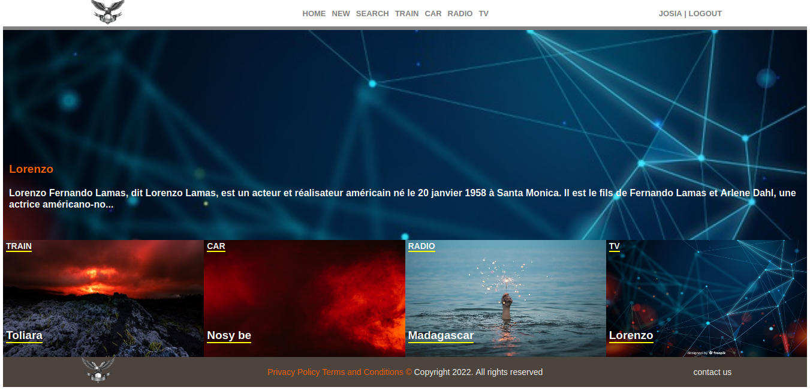
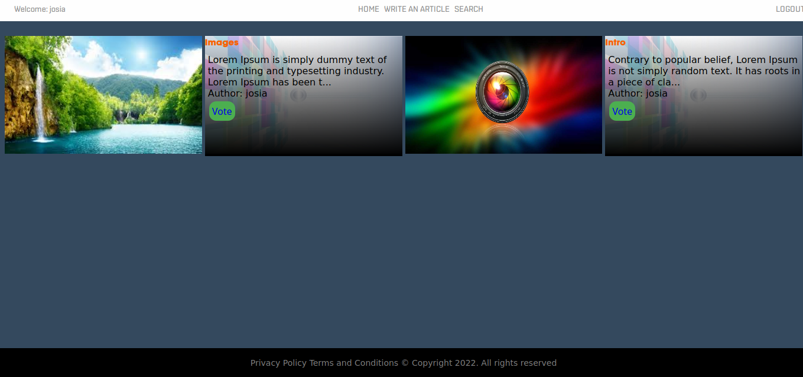
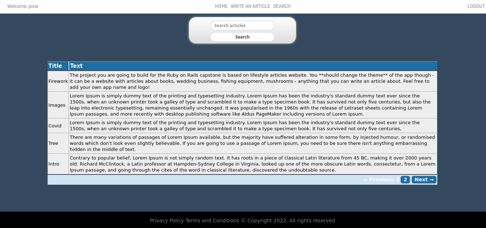

# Ruby on Rails Capstone Project.

In this project, I built a website based on lifestyle articles. I used a lot of knowledge acquired throughout the Ruby on Rails section, Model/View/Controller concepts, some of HTML & CSS, among other knowledge acquired on Microverse to create an MVP for this app.

The project consists of a Sing up/Login with username. The user is presented with the homepage. When the user clicks the category name they can see all articles in that category.

# Screen Home Page

* Login


* Register


* Home


* Articles in selected category page


* Search


## Built With

- Ruby v2.7.0
- Ruby on Rails v5.2.4

## Live Demo

https://powerful-thicket-68686.herokuapp.com/

## Getting Started

* You can get a local copy of the repository please run the following commands on your terminal:s

$ cd < folder >

$ git clone https://github.com/rindrajosia/ror-capstone.git

* You need to install the required gems:

$ bundle install

* Create database

$ rails db:create

* Migrate the database

$ rake db:migrate

* To seed the database

$ rails db:seed

* And run the server:

$ rails server

* To navigate on the app you can enter http://localhost:3000/ on your browser, set a new User and you are ready to log in.

#### Test unit

 Open the project folder with the terminal and run ```bundle exec rspec```


## Author

👤 **Rindra josia**

* Github: **[@rindrajosia](https://github.com/rindrajosia)**
* Twitter: **[@rindrajosia](https://twitter.com/josia_rindra)**
* Linkedin: **[linkedin](https://www.linkedin.com/in/rindra-josia-99b2111a2/)**

## 🤝 Contributing

Contributions, issues and feature requests are welcome!

Feel free to check the [issues page](https://github.com/rindrajosia/ror-capstone/issues).

## Show your support

Give a ⭐️ if you like this project!

## Acknowledgments

 - Project from Microverse
 - Originally taken from The Odin Project
